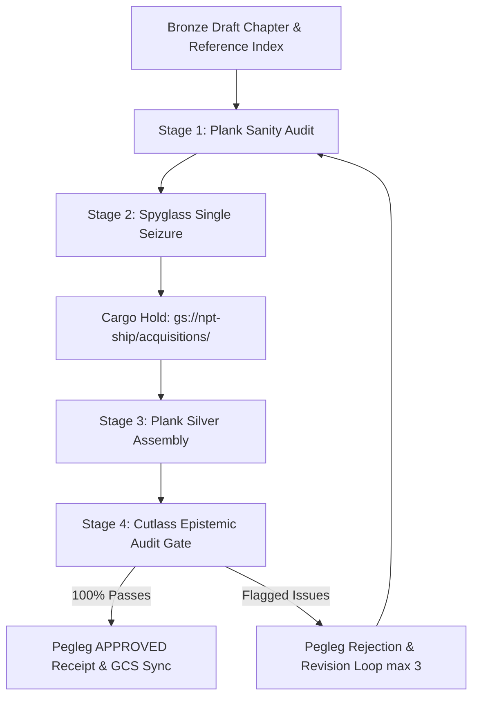

# NPT Fleet Architecture: Silver Vector Storage Layer

The **Silver Layer** is the production-ready, vector-dense text pipeline of the NPT (Knowing) epistemic architecture. It transforms flawed, un-cited, or placeholder-riddled Bronze draft chapters into fully verified, expanded markdown files ready for chunking and ingestion into **pgVector (`ship.letters_of_marque`)**.

---

## 🏛️ Epistemic Silver Standards (ADR-004)

Every Silver file generated by the NPT Fleet must satisfy the following strict epistemic requirements:

1. **Un-truncated Inline Citation Nodes**: All parenthetical shorthands in draft prose (e.g. `(Buchanan & Shortliffe, 1984)`, `(Bender et al., 2021)`, `(Perrigo, 2023)`) are expanded directly in-text into complete bibliographic vector nodes `[Author (Year), "Title", Journal/Publisher, DOI/URL]`.
2. **Parent Container Preservation**: Citations retain parent book containers, volume numbers, and chapter headings (e.g. *Chapter 22 in History of Language AI (Vol. 1: The Statistical Turn)*).
3. **Placeholder Leak Elimination**: All draft placeholder links (e.g. `github.com/microsoft/BotFramework-Composer/issues/3321`) are scrubbed and replaced with verified ground-truth target URLs.
4. **Non-Citation Paren Preservation**: Natural language parenthetical phrases in prose (e.g. `(depth)`, `(December 2023)`) are preserved intact without corruptive regex collisions.
5. **Verified Silver Reference Index**: Appended to the bottom of every Silver markdown chapter as a master list of resolved sources.

---

## 🔄 The 3-Stage Orchestration Triad

The Silver creation process is governed autonomously by **Pegleg** using a closed-loop triad:

1. **Stage 1 (Plank Audit)**: Plank inspects the draft chapter, detects fake/broken URLs, and queries Landlubber for authentic targets.
2. **Stage 2 (Spyglass Single Seizure)**: Spyglass seizes verified external web/PDF content **ONCE** into the permanent Cargo Hold (`cargo.content_metadata`), bypassing paywalls via Botasaurus headless browser scraping.
3. **Stage 3 (Plank Silver Assembly)**: Plank reads ground-truth payloads directly from the Cargo Hold with 0 extra network calls and builds `chXX_silver.md`.
4. **Stage 4 (Cutlass Epistemic Audit)**: Cutlass executes an unsparing, line-by-line adversarial audit of Silver prose vs Bronze input, writing a transparent scorecard (`chXX_citation_audit.md`).
5. **Stage 5 (Pegleg Rejection Gate)**: Pegleg evaluates Cutlass's scorecard. If approved, Pegleg uploads to `gs://npt-ship/silver/chapters/` and logs new rules in `learned_rules.json`. If flagged, Pegleg loops (up to 3 safety loops) to resolve issues.

---

## 📊 Chapter Production Scorecard

| Chapter | Title / Scope | References Audited | Cutlass Audit Result | Pegleg Status | GCS Cloud Sync Path |
| :--- | :--- | :---: | :---: | :---: | :--- |
| **Chapter 1** | *The Architecture of Truth* | 30 / 30 | **30 / 30 Passes (100%)** | `APPROVED` | `gs://npt-ship/silver/chapters/ch01/ch01_silver.md` |
| **Chapter 2** | *Would You Believe Me If I Told You* | 44 / 44 | **44 / 44 Passes (100%)** | `APPROVED` | `gs://npt-ship/silver/chapters/ch02/ch02_silver.md` |

---

## ⚡ Performance & Caching Infrastructure

- **Local Disk Cache**: All resolved CrossRef payloads are persisted to [`data/crossref_cache.json`](file:///c:/Users/timot/NPT-knowing-2/data/crossref_cache.json) for 0 ms local lookups.
- **Academic Pre-Filter**: Non-academic news, Substack, YouTube, and music entries skip CrossRef network requests automatically.
- **CrossRef Polite Pool**: All outbound queries use registered mailto headers (`NPT-Knowing-Fleet/2.0`) to route to CrossRef's dedicated high-rate-limit server pool with 429 exponential backoff retries.
