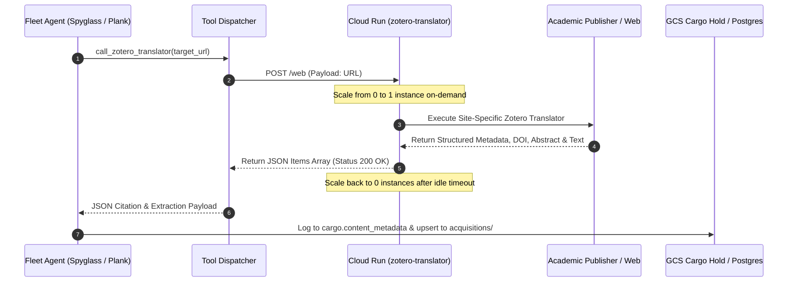

## NPT Fleet: Architecture Decision Records (Master Ledger)

**ADR-001: Atomic Tooling over Monolithic "God Tools"**

* **Context:** The legacy ingestion system relied on a monolithic script handling downloading, cloud uploading, and database logging in a single opaque function.
* **Decision:** Splintered capabilities into atomic, independently callable primitives (`check_cargo_manifest`, `download_url`, `upsert_knowledge_artifact`).
* **Consequences:** Agents possess a granular "Chain of Thought" and can identify exact failure points, though this requires stricter XML prompt governance to prevent deviation.

**ADR-002: Pure PostgreSQL Semantic Memory (Rejection of Vector Abstractions)**

* **Context:** The fleet requires persistent semantic memory across sessions to maintain behavioral rules. Industry patterns heavily favor automated vector-based memory wrappers (e.g., Mem0).
* **Decision:** While LangGraph is retained strictly for short-term turn execution state (`agent_state.checkpoints`), we rejected vector memory abstractions for long-term semantic persistence in favor of pure PostgreSQL (`agent_state.ontology_rules`).
* **Consequences:** Absolute deterministic control. Semantic memory is fully observable and manually editable via standard SQL, eliminating vector-drift hallucinations.

**ADR-003: Strict Database Segregation (Cargo vs. State)**

* **Context:** Mixing content payloads with cognitive state data creates bloated backups, risks cross-contamination, and complicates index optimization.
* **Decision:** The database layer is physically partitioned into two distinct URL connection strings and logical schemas: `CONTENT_DATABASE_URL` maps to the `cargo` schema; `DATABASE_URL` maps to the `agent_state` schema.
* **Consequences:** Tools must explicitly declare which connection they require, establishing a hard firewall between what the agents *think* and what the agents *read*.

**ADR-004: Continuous File Telemetry over Cloud Logging**

* **Context:** Forcing standard output streams into GCP Cloud Logging during local development creates high latency and requires heavy IAM permission management.
* **Decision:** The `AgentEngine` is hardcoded to dump the fully assembled XML + DB system prompt to `logs/<agent_name>_system_prompt.txt` on initialization, and append every interaction to `logs/<agent_name>_interactions.log`.
* **Consequences:** Absolute offline observability for the human architect, requiring strict `.gitignore` enforcement.

**ADR-005: Dual-Mode Entrypoints (Headless vs. Interactive)**

* **Context:** Agents need to be orchestrated by automated batch-runners (Pegleg) but also require direct human coaching via the terminal.
* **Decision:** Entrypoint runners implement a dual-mode `if/else` logic gate: Mode A (Headless) triggers via specific command-line flags for sequential execution; Mode B (Interactive) drops the human into a `while True:` loop for real-time coaching.

**ADR-006: Deterministic Artifact Storage & Ingestion Upserts**

* **Context:** Using timestamp-based filenames during an upsert creates orphaned "ghost" files in Google Cloud Storage, quietly driving up storage costs.
* **Decision:** We mandate Pure Determinism in cloud storage. All acquired knowledge artifacts use a deterministic file slug derived directly from the canonical URL. Timestamp-based file names for content artifacts are explicitly banned.
* **Consequences:** The GCP bucket functions as a self-cleaning key-value store. Reprocessing a URL automatically overwrites the old blob, eliminating storage bloat.

**ADR-007: Receipt-Based Token Economics & Deterministic Ingestion Fallbacks**

* **Context:** Passing 50,000+ character HTML payloads back into the LLM’s chat history just to trigger an upload tool was bankrupting the token economy.
* **Decision:** Text manipulation is shifted out of the LLM context. The `download_url` tool saves the raw text to a local cache and returns a lightweight JSON "receipt" to the agent. Furthermore, live self-learning for ingestion was rejected in favor of a deterministic Tier 1 (`requests`) to Tier 2 (`Botasaurus`) fallback.
* **Consequences:** Token consumption per ingested article drops by roughly 99%. Spyglass is structurally barred from performing qualitative analysis during the ingestion phase.

**ADR-008: The JSONB Silver Ledger (Rejection of Markdown Dumps)**

* **Context:** Downstream synthesis agents (Scallywag) cannot reliably parse or query unstructured text files dumped by mid-tier analytical agents (Cutlass).
* **Decision:** We mandate that all Silver-tier epistemic triage and enrichments must be formatted as strictly typed JSON objects and inserted into a PostgreSQL ledger (`cargo.fleet_enrichments`) via the `log_fleet_enrichment` tool.
* **Consequences:** The system gains a highly structured, mathematically queryable database of epistemic failures, drastically improving the reliability of the Gold-tier synthesis phase.
**ADR-009: Standardizing Agent XML Schema and Rules Ingestion Engine**

* **Context:** Legacy agent profiles used non-standard `<heuristics>` tags which were silently ignored by `AgentEngine`, truncating rules into single-line summaries and leaving orchestrators like Pegleg without full rule visibility. Furthermore, multi-step workflows were mislabeled as passive `<core_mandate>` text rather than executable `<skills>`.
* **Decision:** 
  1. Deprecate legacy `<heuristics>` XML tags across all agent definitions in favor of standard `<rules>` (operational boundaries) and `<guardrails>` (anti-hallucination/sycophancy controls).
  2. Refactor `AgentEngine._build_dynamic_system_prompt()` to load and format the full rule directive, rationale, and context without character truncation.
  3. Reclassify multi-stage workflows as executable `<skills>` with explicit protocols.
  4. Ensure orchestrators run true `AgentEngine` ReAct sessions rather than hardcoded Python prompt strings.
* **Consequences:** Agents operate with 100% prompt visibility into their full rule directives and guardrails. System instructions become completely observable, consistent across agents, and aligned with modern AI agent engineering standards.

**ADR-010: Dual Progenitor Convergence (Hook-Antigravity Cognitive Parity & Human Backlog Governance)**

* **Context:** The system maintained two separate meta-architectural execution environments: Antigravity (the IDE pair-programmer governed by `GEMINI.md`) and Hook (the autonomous CLI progenitor governed by `Hook_constitutiuon.md` and `hook.xml`). Over time, this caused Split-Brain Drift: Hook operated on stale, hardcoded agent rosters and legacy tool paths, while Antigravity operated on live project reality. Furthermore, GitHub Issues was being misused as an automated error dump by content scrapers (e.g. Spyglass opening issues for 403 HTTP paywalls), drowning human architectural ideas in backlog noise.
* **Decision:**
  1. *Dual-Harness Coexistence:* Both Hook (terminal/CLI runner) and Antigravity (IDE pair-programmer) remain fully active and supported.
  2. *Cognitive & Mandate Parity:* Hook and Antigravity share an identical engineering personality and operational mandate. `GEMINI.md` absorbs Hook's core engineering virtues: Structural Finality (complete implementations; zero conversational fluff), Strict Spatial Verification & PIP Compliance (mandatory physical tool calls to read disk before asserting facts), and Leading with Decisions before rationale.
  3. *Single Source of Truth Bootstrapping:* `hook_runner.py` and `hook.xml` dynamically ingest `GEMINI.md` and `fleet_roster.json` on startup via `AgentEngine`. Hook will no longer maintain a divergent, hardcoded roster.
  4. *GitHub Issues Namespace Boundary:* GitHub Issues is designated exclusively as the Human Architect & Meta-Architect Backlog (Timothy, Hook, and Antigravity). Domain content agents (Spyglass, Cutlass, Grog, Plank, Bilgeladle, Scallywag) are strictly stripped of GitHub issue-creation tools. Content acquisition failures must be logged exclusively to `cargo.failed_metadata` (per ADR-003), preventing scraper noise from polluting the backlog.
* **Consequences:** Perfect alignment between IDE and terminal sessions. Zero drift between Antigravity and Hook. Clean, high-signal GitHub backlog dedicated entirely to deliberate human feature requests and architectural changes.

**ADR-011: Unified Developer Action Logging & Interaction Provenance**

* **Context:** To maintain system integrity and auditability across rapid multi-agent evolution, the human architect requires an unbroken, offline forensic log of all user requests, agent decisions, tool invocations, and parameter mutations executed by both Hook (in terminal) and Antigravity (in IDE).
* **Decision:**
  1. *Antigravity Native Telemetry Integration:* Formally leverage Antigravity's built-in session transcript engine located at `<appDataDir>/brain/<conversation_id>/.system_generated/logs/transcript.jsonl` (and `transcript_full.jsonl`). These append-only JSONL ledgers record every user prompt, model reasoning step, tool call, and stdout response with microsecond timestamps.
  2. *Standardized Hook Turn Logging:* Standardize Hook's local file logging to mirror this depth: Every user request and turn prompt is committed to `logs/hook_requests.log`; every tool call, raw stdout response, and error payload is streamed to `logs/hook_interactions.log`; system prompt compilation states are dumped to `logs/hook_system_prompt.txt` upon engine boot (per ADR-004).
  3. *Log Directory Governance:* All local log dumps remain strictly localized in `logs/` and permanently excluded from version control via `.gitignore`.
* **Consequences:** 100% forensic replayability of all architectural modifications regardless of whether they were performed via Antigravity in the IDE or Hook in the terminal.

**ADR-012: Cross-Harness Bi-Directional Learning (Shared Rule Vaults)**

* **Context:** When a developer corrects a behavior or discovers a new heuristic in Antigravity (e.g. using `/learn` or refining an architectural pattern), that learning historically remained trapped in IDE memory or `GEMINI.md`. Conversely, rules recorded by Hook via `record_learned_rule` went into local agent JSON files that Antigravity might not immediately index.
* **Decision:**
  1. *Shared Knowledge Vaults as Single Source of Truth:* All operational heuristics, behavioral corrections, and architectural rules are standardized into two shared, version-controlled JSON vaults: `src/react_agent/core_knowledge_vault/shared_fleet_rules.json` (Fleet-universal rules) and `src/react_agent/agents/{agent_name}/learned_rules.json` (Agent-specific local rules).
  2. *Bi-Directional Learning Protocol:*
     - *Antigravity -> Hook:* When Antigravity learns or refines an engineering directive during pair programming, the rule is committed directly to `shared_fleet_rules.json` (or `GEMINI.md`). On the next terminal invocation of `hook_runner.py`, Hook immediately boots with that new learned rule in her system prompt.
     - *Hook -> Antigravity:* When Hook generates a rule during terminal execution via `record_learned_rule`, it is written to the shared JSON vaults and referenced in `GEMINI.md`, instantly making it visible to Antigravity.
  3. *Deprecation of Isolated Learning Sinks:* Deprecate separate, one-off XML rule staging directories (`src/react_agent/agents/hook/rules/*.xml`) and legacy ledgers (`learning_ledger.json`) in favor of direct commits to the shared JSON vaults.
* **Consequences:** Continuous, cross-pollinating intelligence. A lesson taught once to Antigravity in the IDE is permanently learned by Hook in the terminal, and vice-versa. Strict JSON schema adherence required for rule formatting.

**ADR-013: Hybrid Memory & Pointer Architecture (Full Manuscript System Prompt Injection with On-Demand Section Expansions and Receipt-Based Cargo Handoffs)**

* **Context:** Large language models historically suffered from small context windows, prompting Map-Reduce section slicing. However, modern models (Gemini 3.7 Flash) offer 1M+ token context with high recall at $0.07/1M input tokens. Loading the complete 374 KB manuscript into Bilgeladle's system prompt costs ~$0.007 per turn while providing complete, un-fragmented thesis memory. Meanwhile, multi-agent cargo handoffs (Spyglass -> Cutlass -> Grog -> Bilgeladle -> Scallywag) exploded in cost when raw article texts and full section expansions were concatenated directly into prompt strings.
* **Decision:**
  1. *Full Manuscript Corpus Injection for Bilgeladle:* `AgentEngine` will continue injecting `ship/bronze_plus/End-of-Knowing-latest.md` directly into Bilgeladle's system prompt, giving her complete, unbroken thesis vision for <$0.01 per turn.
  2. *Receipt-Based File Pointers for Incoming Cargo (ADR-007 Enforcement):* Inter-agent multi-stage pipelines must pass lightweight file pointers / GCS paths (`acquisitions/[slug].txt`) and database IDs rather than concatenating raw text strings into prompts. Downstream agents stream or inspect files on demand via `read_knowledge_artifact` / `read_local_file`.
  3. *On-Demand Section Expansions (`ship/expansions/`):* Deep section expansions (e.g. `ch01_sec1.4_expansion.md`) are preserved as specialized reference deep-dives, loaded on-demand via tool calls (`read_local_file`) when a specific section requires forensic audit.
* **Consequences:** Bilgeladle maintains total, un-fragmented manuscript awareness at negligible cost (~$0.007/turn), while multi-agent chases reduce prompt context payload size by ~99% per turn across the fleet.

**ADR-014: Serverless Zotero Translation Engine on Google Cloud Run**

* **Context:** External academic publishers (Nature, ScienceDirect/Elsevier, IEEE Xplore, JSTOR, Springer, Wiley) enforce severe scraping countermeasures (Cloudflare Turnstile, browser fingerprinting, and paywall authentication gates). Standard HTTP requests return HTTP 403, and headless browsers like Botasaurus frequently hang on heavy CAPTCHA challenges or fail to capture the underlying citation graph. Meanwhile, Zotero's open-source Translation Server maintains thousands of specialized, community-curated web scrapers ("translators") engineered specifically to extract rich bibliographic metadata and article text from scholarly databases. However, running a persistent Kubernetes (GKE) cluster or compute instance for translation services incurs an unacceptable idle overhead ($70+/month for GKE control planes alone).
* **Decision:**
  1. *Serverless Microservice Architecture:* Deploy the Zotero Translation Server to Google Cloud Run as a managed, stateless service (`zotero-translator`) in region `us-central1`.
  2. *Scale-to-Zero Guardrail:* Enforce `--min-instances=0` and `--max-instances=2`. When no ingestion or reference resolution tasks are running, Cloud Run scales to zero instances, ensuring a **$0.00 idle operating cost**. Cold-start latency on Cloud Run is under 2 seconds.
  3. *Cloud Build Recursive Container Assembly:* Package the container using Node 20 LTS via Google Cloud Build, cloning the repository with `--recurse-submodules` to incorporate all required Zotero submodules (`modules/translators`, `modules/utilities`, `modules/zotero-schema`, `modules/translate`). Bind Node natively to `0.0.0.0:8080` to eliminate shell script execution format errors.
  4. *Multi-Agent Fleet Tool Dispatch:* Expose `call_zotero_translator(target_url)` across `acquisition_tools.py` and `tool_dispatcher.py`. Grant access to **Spyglass** (for bypassing academic paywalls during external cargo acquisition) and **Plank** (for expanding and verifying un-truncated vector node citations in manuscript chapters).
* **System Flow & Sequence:**

* **Consequences:** Eliminates scraping barriers on protected scholarly domains. Yields bit-for-bit extraction of complex citation structures (authors, DOIs, volume, issue, publication dates, and abstracts) directly matching Zotero's data contract. Incurs zero compute expense when idle.

**ADR-015: Two-Tier Content Storage Architecture: Permanent Asset Dossiers vs. Chase Synthesis Sinks**

* **Context:** In multi-stage investigative sweeps ("Chases"), early stage deliverables—specifically Cutlass's epistemic and structural logic audit (Stage 2) and Grog's core factual extraction (Stage 3)—were historically written directly into transient chase folders (`writings/chases/{chase_id}/stage2_cutlass_{slug}.md`). However, Round 1 audits are strictly prompt-free, objective deconstructions of what the external content says, what it is, and its evidentiary warrants. Trapping these evaluations in specific chase folders forced the fleet to redundantly re-audit assets when reused across different chases, chapter expansions, or standalone research sprints, wasting substantial LLM tokens and API budget. Furthermore, running multi-turn asset audits in monolithic chase threads caused exponential context token accumulation.
* **Decision:**
  1. *Physical Output Separation:* Establish a strict physical boundary between **Reusable Asset Dossiers** and **Chase Synthesis Deliverables**:
     - **Reusable Asset Dossiers (`writings/cargo/cargo_{metadata_id}/`)**: Indexed permanently by database metadata ID (`cargo_{id}`). Houses objective, prompt-free asset assessments:
       - `cutlass_audit.md`: Epistemic deconstruction (SAYS vs IS), Chain of Ruin evaluation, Causal Warrants & Claims, Epistemic Fallacy Scan, Sail Locker rating (`MAINSAIL`/`BILGE`/`JIB`), and Epistemic Scorecard.
       - `grog_extraction.md`: Dead Reckoning, Fact Plumbing, Strict Summary, and Reference Sightings.
       - `cargo_ontology.json`: Entity-relationship knowledge graph primitives.
     - **Chase Synthesis Sinks (`writings/chases/{chase_id}/`)**: Reserved strictly for deliverables that compare multiple assets or directly answer the Author's thesis prompt:
       - `stage4_bilgeladle_alignment.md`: Thesis mapping of the asset cluster against manuscript chapters.
       - `stage5_scallywag_essay.md`: Satirical synthesis essay answering the Author's inquiry prompt.
       - `stage6_peer_reviews.md`: Bilgeladle and Cutlass peer consensus reviews of Scallywag.
       - `chase_status.md`: Real-time stage gate and telemetry log.
  2. *Pre-Flight Reuse Gate:* Before dispatching Cutlass (Stage 2) or Grog (Stage 3), Pegleg must inspect `writings/cargo/cargo_{metadata_id}/`. If the deliverable exists, Pegleg reuses it immediately with **zero token spend**.
  3. *Deterministic Thread Binding:* Asset-level subagent turns are bound to `cargo_{metadata_id}_{agent_name}` (e.g. `cargo_238_cutlass`), ensuring clean ~25k token context windows and perfect resuscitability for subsequent revisions.
* **Consequences:** Eliminates redundant token expenditure across multi-asset chases. Creates a cumulative, searchable knowledge repository of audited cargo assets. Decouples objective forensic deconstruction from prompt-biased narrative synthesis. Ensures tri-fold alignment across PostgreSQL (`cargo.content_metadata.id`), ReAct cognitive threads (`cargo_{metadata_id}`), and disk storage (`writings/cargo/cargo_{metadata_id}/`).

