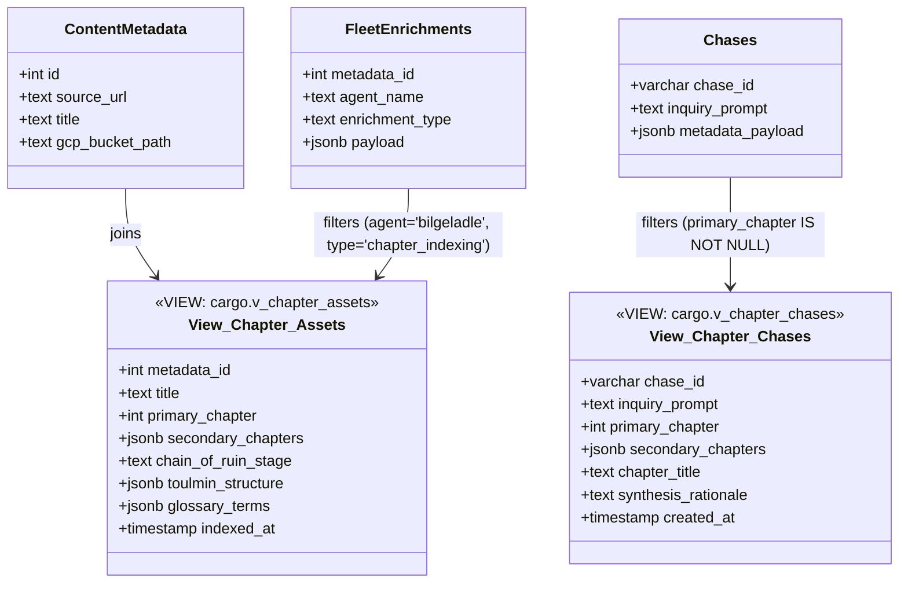

# NPT Fleet: Master Database Entity-Relationship Diagram (ERD)

This document provides the complete, authoritative Entity-Relationship Diagram for all PostgreSQL schemas and tables across the **NPT Fleet** architecture, detailing primary keys, foreign keys, JSONB payloads, and analytical SQL views.

---

## 1. Global Multi-Schema Architecture

The system enforces strict architectural partitioning across two distinct database wire connections (**ADR-003**):

1. **`CONTENT_DATABASE_URL`** (Warehouse Wire):
   - **`cargo` Schema**: Master catalog of external cargo assets, dead-letter telemetry, enrichment logs, chase sessions, and system glossary.
   - **`ship` Schema**: The book manuscript Vector Database (`ship.letters_of_marque`).
2. **`DATABASE_URL`** (Cognitive State Wire):
   - **`agent_state` Schema**: Short-term ReAct turn conversation checkpoints and long-term learned behavioral rules.

---

## 2. Complete Entity-Relationship Diagram (Mermaid)

```mermaid
erDiagram
    %% CARGO SCHEMA: CONTENT & INGESTION
    "cargo.content_metadata" {
        integer id PK "Serial primary key"
        text source_url "Unique canonical URL"
        text item_type "webpage, journalArticle, preprint, report"
        text title "Asset title"
        jsonb authors "Array of author strings or objects"
        text publication_title "Journal, outlet, or publisher"
        text publication_date "ISO date or year string"
        text abstract "Full abstract or summary"
        jsonb keywords "Classification tags"
        text rights "Copyright or access status"
        text gcp_bucket_path "GCS artifact URI (acquisitions/slug.txt)"
        timestamp created_at "Timestamp of capture"
    }

    "cargo.failed_metadata" {
        integer failure_id PK "Serial primary key"
        text source_url "Target URL that failed acquisition"
        text derived_domain "Domain name"
        boolean tier_1_executed "Direct requests HTTP status"
        boolean tier_2_executed "Botasaurus anti-detect status"
        boolean method_3_tried "Fallback scraping status"
        text error_state "Canonical error code"
        text error_message "Diagnostic error trace"
        timestamp failed_at "Failure timestamp"
    }

    "cargo.ingestion_queue" {
        integer queue_id PK "Serial primary key"
        text target_url "URL queued for acquisition"
        varchar status "PENDING, IN_PROGRESS, COMPLETED, FAILED"
        varchar source_requestor "Agent or human requestor"
        timestamp added_at "Queue timestamp"
        timestamp last_attempted_at "Last attempt timestamp"
        integer attempt_count "Retry attempt counter"
    }

    "cargo.system_glossary" {
        varchar term PK "Glossary concept name"
        text definition "Forensic definition"
        text provenance_context "Manuscript source and origin"
        timestamp last_updated "Update timestamp"
    }

    %% CARGO SCHEMA: ENRICHMENTS & CHASES
    "cargo.fleet_enrichments" {
        integer id PK "Serial primary key"
        integer metadata_id FK "References cargo.content_metadata(id)"
        text agent_name "cutlass, grog, bilgeladle, scallywag"
        text enrichment_type "epistemic_audit, core_extraction, chapter_indexing"
        jsonb payload "Structured analysis, Toulmin warrants, sail lockers"
        timestamp created_at "Enrichment timestamp"
    }

    "cargo.chases" {
        varchar chase_id PK "Unique chase thread identifier (e.g. august-chase-11)"
        text inquiry_prompt "Author inquiry or thesis question"
        varchar status "IN_PROGRESS, COMPLETED, DOLDRUMS_HALT"
        jsonb metadata_payload "Primary chapter, secondary chapters, synthesis"
        timestamp created_at "Chase initiation timestamp"
        timestamp completed_at "Chase completion timestamp"
    }

    "cargo.chase_assets" {
        integer id PK "Serial primary key"
        varchar chase_id FK "References cargo.chases(chase_id) ON DELETE CASCADE"
        integer metadata_id FK "References cargo.content_metadata(id) ON DELETE CASCADE"
        timestamp added_at "Binding timestamp"
    }

    %% SHIP SCHEMA: MANUSCRIPT VECTOR STORE
    "ship.letters_of_marque" {
        uuid chunk_id PK "Chunk identifier"
        varchar chapter_id "e.g. ch08"
        varchar section_id "e.g. ch08_sec8.2"
        integer paragraph_index "Sequential index"
        text chunk_text "Verbatim manuscript text"
        vector_768 embedding "Google Gecko/Embedding-004 vector"
        timestamp embedded_at "Embedding timestamp"
    }

    %% AGENT STATE SCHEMA: COGNITIVE SESSIONS
    "agent_state.checkpoints" {
        varchar thread_id PK "Active agent session thread ID"
        jsonb state_payload "Conversation history & tool traces"
        timestamp updated_at "Last turn checkpoint timestamp"
    }

    "agent_state.ontology_rules" {
        integer rule_id PK "Serial primary key"
        varchar scope "GLOBAL, AGENT_LOCAL"
        text directive "Learned behavioral directive"
        varchar source_thread_id "Originating thread ID"
        timestamp created_at "Rule formulation timestamp"
    }

    %% RELATIONSHIPS
    "cargo.content_metadata" ||--o{ "cargo.fleet_enrichments" : "has enrichments"
    "cargo.content_metadata" ||--o{ "cargo.chase_assets" : "included in"
    "cargo.chases" ||--o{ "cargo.chase_assets" : "contains assets"
```



---

## 3. Relational Views & Convenience Abstractions



---

## 4. SQL Usage Examples

### A. Discover All Assets Mapped to Chapter 10 (Education & Literacy)
```sql
SELECT 
    metadata_id,
    title,
    source_url,
    gcp_bucket_path,
    chain_of_ruin_stage,
    toulmin_structure->>'claim' AS core_claim,
    toulmin_structure->>'grounds' AS evidence
FROM cargo.v_chapter_assets
WHERE primary_chapter = 10 
   OR secondary_chapters @> '[10]'
ORDER BY indexed_at DESC;
```

### B. Discover All Chases Investigating Chapter 8 (Vaporized Memory & DRM)
```sql
SELECT 
    chase_id,
    inquiry_prompt,
    status,
    synthesis_rationale,
    created_at
FROM cargo.v_chapter_chases
WHERE primary_chapter = 8 
   OR secondary_chapters @> '[8]'
ORDER BY created_at DESC;
```

### C. Find Which Chases Evaluated a Specific Asset
```sql
SELECT 
    ch.chase_id,
    ch.inquiry_prompt,
    ca.added_at
FROM cargo.chases ch
JOIN cargo.chase_assets ca ON ch.chase_id = ca.chase_id
WHERE ca.metadata_id = 42;
```
