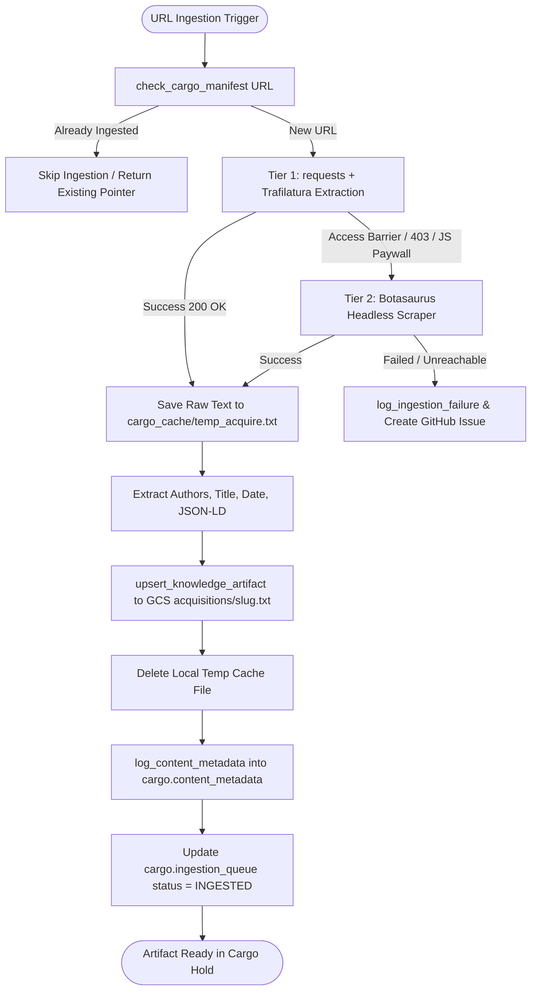
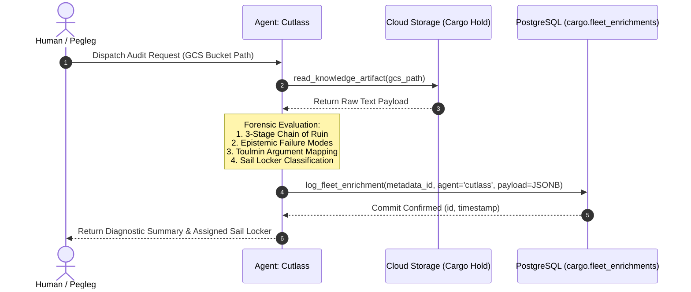
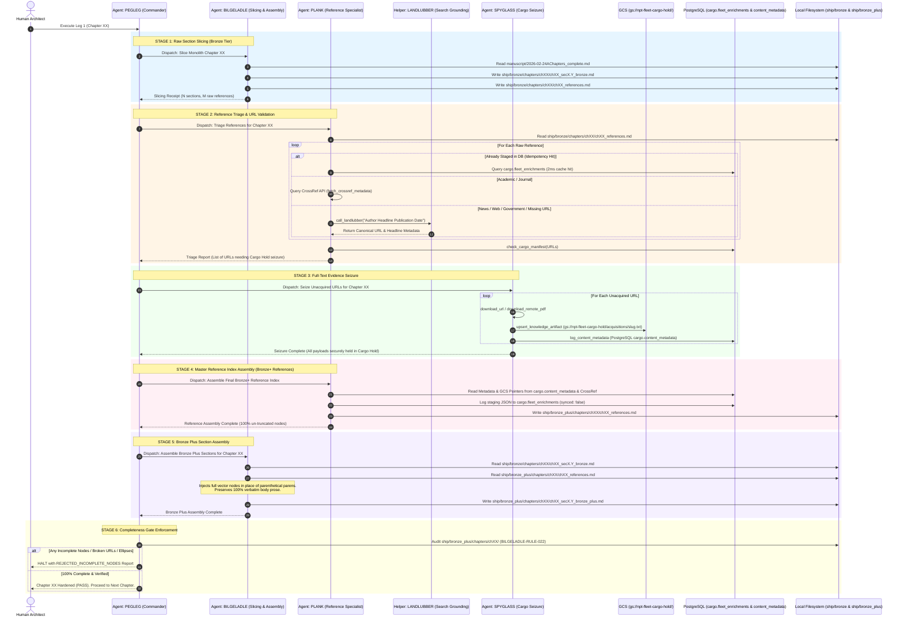
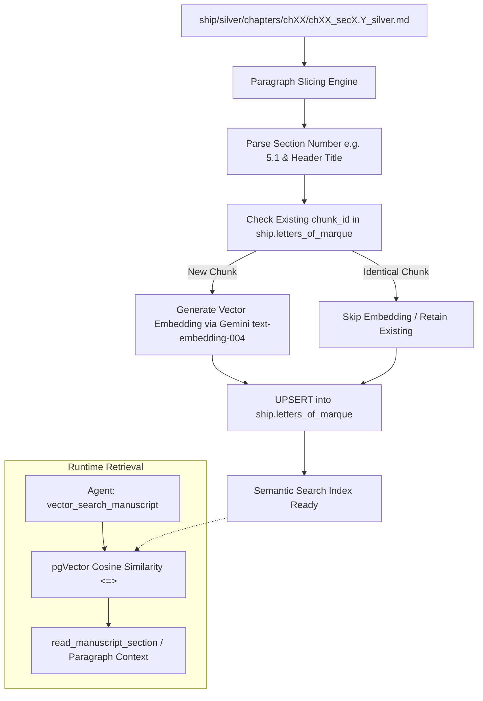
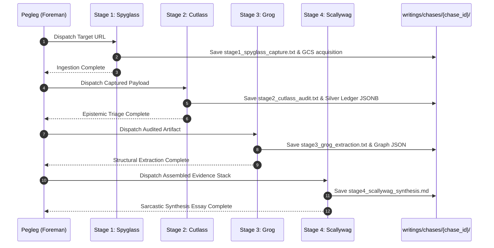
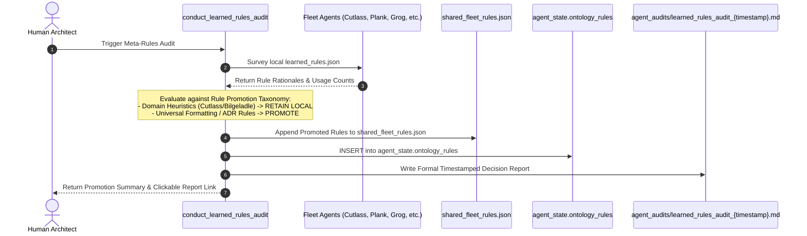

# NPT Fleet: Workflows, Architecture & System Flows

This document details the core multi-agent execution pipelines of the NPT Fleet, providing architectural flowcharts and sequence diagrams for each workflow.

---

## Index of Workflows

1. [Workflow 1: Web Ingestion & Content Seizure (Spyglass)](#workflow-1-web-ingestion--content-seizure) *(Flow Diagram)*
2. [Workflow 2: Epistemic Triage & The Silver Ledger (Cutlass)](#workflow-2-epistemic-triage--the-silver-ledger) *(Sequence Diagram)*
3. [Workflow 3: 6-Stage Chapter Silver Production Pipeline](#workflow-3-6-stage-chapter-silver-production-pipeline) *(Sequence & Flow Diagrams)*
4. [Workflow 4: Vector Database (VDB) Embedding & Semantic Search](#workflow-4-vector-database-vdb-embedding--semantic-search) *(Flow Diagram)*
5. [Workflow 5: Chase Protocol (Multi-Agent Epistemic Sweep)](#workflow-5-the-chase-protocol) *(Sequence Diagram)*
6. [Workflow 6: Autonomous Meta-Learning & Learned Rules Audit](#workflow-6-autonomous-meta-learning--rule-audit) *(Sequence Diagram)*

---

## Workflow 1: Web Ingestion & Content Seizure

**Objective**: Safely acquire external articles, reports, or academic papers, extract structured JSON-LD metadata, and upload text payloads to Google Cloud Storage without token bloat.

### Flow Diagram

---

## Workflow 2: Epistemic Triage & The Silver Ledger

**Objective**: Perform deep forensic epistemological evaluation on ingested documents and log structured, mathematically queryable JSONB payloads to PostgreSQL without unstructured text dumps.

### Sequence Diagram

---

## Workflow 3: Manuscript Bronze to Bronze Plus Pipeline (Leg 1)

**Objective**: Convert monolithic chapter markdown into high-signal, fully verified section-level Bronze Plus files (`ship/bronze_plus/`) containing complete CrossRef/Zotero citation nodes. **Bronze Plus is the exclusive source for populating the Vector Database (`ship.letters_of_marque`).**

### Sequence Diagram

### Stage-by-Stage Operational Ledger

| Stage | Responsible Agent | Primary Skill | Tools & Data Interfaces | Physical Outputs |
| :--- | :--- | :--- | :--- | :--- |
| **1. Bronze Slicing** | **Bilgeladle** | `manuscript-chapter-section-slicing` | `slice_monolith_to_bronze_sections` | `ship/bronze/chapters/chXX/chXX_secX.Y_bronze.md` `ship/bronze/chapters/chXX/chXX_references.md` |
| **2. Reference Triage** | **Plank** | `manuscript-chapter-section-inline-reference-expansion` | `fetch_crossref_metadata` `call_landlubber` `check_cargo_manifest` | Missing Payload List reported to **Pegleg** |
| **3. Cargo Seizure** | **Spyglass** | `bootstrap-ingestion` | `download_url` `upsert_knowledge_artifact` `log_content_metadata` | Raw text in `gs://npt-fleet-cargo-hold/acquisitions/` Metadata in `cargo.content_metadata` |
| **4. Reference Assembly** | **Plank** | `manuscript-chapter-section-inline-reference-expansion` | `log_fleet_enrichment` | `ship/bronze_plus/chapters/chXX/chXX_references.md` JSON staging in `cargo.fleet_enrichments` |
| **5. Bronze+ Assembly** | **Bilgeladle** | `manuscript-section-bronze-plus-assembly` | `expand_in_text_citations` (file I/O) | `ship/bronze_plus/chapters/chXX/chXX_secX.Y_bronze_plus.md` (100% verbatim text + full vector nodes) |
| **6. Completeness Gate** | **Pegleg** | `orchestrate-bilgeladle-manuscript-bronze-creation` | File audit checks | Enforces `BILGELADLE-RULE-022` (100% live URLs). Clears chapter. |

---

## Workflow 4: Vector Database (VDB) Embedding & Semantic Search

**Objective**: Slice Silver section files into contiguous paragraphs, generate 768-dimensional Gemini embeddings, and store them in PostgreSQL `pgvector` for semantic manuscript exploration.

### Flow Diagram

---

## Workflow 5: The Chase Protocol

**Objective**: A fast, synchronized four-stage intelligence sweep on a single breaking event or controversial article.

### Sequence Diagram

---

## Workflow 6: Autonomous Meta-Learning & Rule Audit

**Objective**: Periodically audit agent `learned_rules.json` files, survey agents regarding rule boundaries, and promote universal heuristics to the shared rules vault.

### Sequence Diagram

