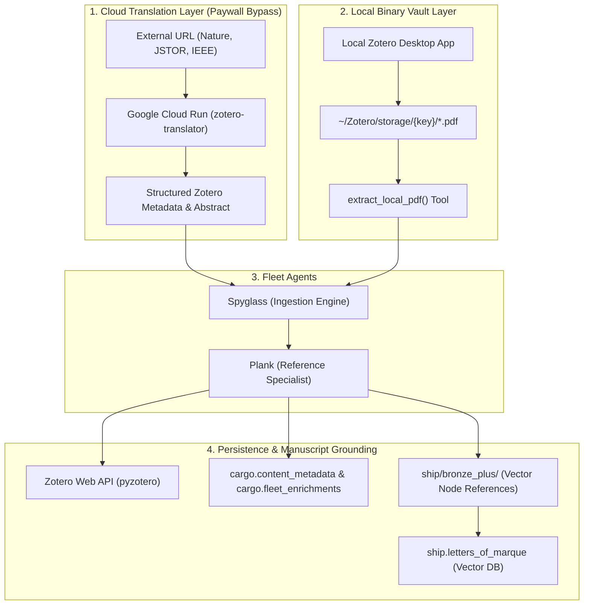

# Zotero Integration Guide: The Fleet's Intellectual Provenance Spine

This document provides a complete reference for all Zotero integrations operating across the **NPT Fleet**. Zotero serves as the authoritative bibliographic foundation of the project, connecting wild external web cargo to the rigorous academic citations of the manuscript (*The End of Knowing*).

---

## 1. System Overview & Architecture

In the NPT Fleet architecture, Zotero is not just a reference manager; it is an active epistemic engine used across four distinct operational layers:



---

## 2. The Four Zotero Integration Pillars

### Pillar A: Serverless Translation Server on Google Cloud Run (`call_zotero_translator`)
* **Purpose**: Bypasses academic paywalls and anti-bot defenses on scholarly domains (Nature, ScienceDirect/Elsevier, IEEE Xplore, JSTOR, Springer, Wiley, ACM).
* **Endpoint**: `https://zotero-translator-809652732702.us-central1.run.app/web`
* **How It Works**:
  1. The tool sends an HTTP POST request containing the target URL.
  2. The serverless container spins up in Google Cloud Run within 2 seconds.
  3. The server invokes Zotero’s official, community-maintained web translator designed specifically for that academic domain.
  4. It extracts structured JSON metadata (creators, publication title, volume, issue, DOI, publication date, and full abstracts).
  5. The container scales down to zero instances when idle (**$0.00 idle cost**).
* **Primary Tools**: `call_zotero_translator(target_url)` in [`src/react_agent/tools/acquisition_tools.py`](file:///c:/Users/timot/NPT-knowing-2/src/react_agent/tools/acquisition_tools.py).
* **Governing ADR**: ADR-014.

---

### Pillar B: Local PDF Vault Extraction (`extract_local_pdf`)
* **Purpose**: A local "break-glass" protocol for closed-access papers that cannot be fetched over the public web or via Cloud Run.
* **How It Works**:
  1. If an asset is behind a strict institutional login, the human architect saves the PDF into their local desktop Zotero library.
  2. Zotero stores the PDF under the user's local directory: `C:\Users\timot\Zotero\storage\{zotero_storage_key}\paper.pdf`.
  3. Spyglass invokes `extract_local_pdf(zotero_storage_key)`.
  4. The tool locates the local file on disk, extracts the binary text stream page-by-page using `pypdf`, and registers the content into the fleet cargo hold.
* **Primary Tools**: `extract_local_pdf(zotero_storage_key)` in [`src/react_agent/tools/acquisition_tools.py`](file:///c:/Users/timot/NPT-knowing-2/src/react_agent/tools/acquisition_tools.py).

---

### Pillar C: Cloud Library Synchronization (`zotero_tools.py`)
* **Purpose**: Synchronizing cataloged fleet artifacts directly with the user’s personal cloud-hosted Zotero collection via the official Zotero Web API.
* **How It Works**:
  * Authenticates using `ZOTERO_API_KEY` and `ZOTERO_USER_ID` via `pyzotero`.
  * **`fetch_zotero_unresolved_items()`**: Polls the Zotero library for placeholder citations or items lacking full text.
  * **`create_zotero_item(item_type, title, creators, ...)`**: Creates canonical Zotero library items with strict bibliographic typing (`journalArticle`, `book`, `report`, `webpage`, `blogPost`).
  * **`update_zotero_ledger(queue_id, zotero_item_key)`**: Links database queue IDs in PostgreSQL to the permanent Zotero storage key for end-to-end intellectual provenance.
* **Primary Tools**: [`src/react_agent/tools/zotero_tools.py`](file:///c:/Users/timot/NPT-knowing-2/src/react_agent/tools/zotero_tools.py).

---

### Pillar D: Vector Node Resolution & Citation Taxonomy (Plank)
* **Purpose**: Resolving raw citations in manuscript text into authoritative vector nodes for the pgVector database (`ship.letters_of_marque`).
* **The 5-Category Citation Taxonomy**:
  1. `ACADEMIC`: Peer-reviewed papers and conference proceedings (enriched via CrossRef and Zotero).
  2. `WEB_TECHNICAL`: Technical documentation, GitHub repositories, and AI lab whitepapers.
  3. `NEWS_MEDIA`: Investigative journalism, magazine features, and trade publications.
  4. `LEGAL_GOV`: Court filings, regulatory dockets, and congressional testimony.
  5. `CLASSICAL_CANONICAL`: Historical monographs, philosophical treatises, and canonical literature.
* **Strict Anti-Truncation Gate**: Plank forbids the use of ellipses (`...`) in author lists or titles. Reference nodes must be fully qualified:
  ```markdown
  [Author, A. & Author, B. (Year), "Full Canonical Title", Journal Name, Volume(Issue), DOI/URL]
  ```
* **Primary Agent**: **Plank** ([`plank.xml`](file:///c:/Users/timot/NPT-knowing-2/src/react_agent/agents/plank/plank.xml)).

---

## 3. Environment Variables & Configuration

The Zotero ecosystem relies on the following environment variables configured in `.env`:

| Variable | Description | Default / Example |
| :--- | :--- | :--- |
| `ZOTERO_API_KEY` | Personal API key for Zotero Web API access | Generated via zotero.org settings |
| `ZOTERO_USER_ID` | Numeric Zotero User ID for the user's primary library | Found in Zotero API settings |
| `ZOTERO_COLLECTION_ID` | Specific collection key where fleet cargo is staged | Optional (defaults to root library) |
| `ZOTERO_TRANSLATOR_URL` | Cloud Run service endpoint for translation-server | `https://zotero-translator-809652732702.us-central1.run.app/web` |
| `USERPROFILE` | Path to Windows user home for locating local PDF storage | Automatically resolved to `C:\Users\timot` |

---

## 4. Troubleshooting & Operational Tips

1. **Cold Starts on Cloud Run**:
   * If `call_zotero_translator` has not been invoked in several hours, the initial HTTP POST may take 2–3 seconds as Cloud Run spins up container instance #1 from zero. Subsequent requests respond in <500ms.
2. **Missing Local PDF Storage**:
   * If `extract_local_pdf` returns `[ERROR] Storage folder not found`, verify that Zotero Desktop is open and has finished syncing the target item attachment locally.
3. **Translation Server Submodule Updates**:
   * Zotero translators are regularly updated by the community. To refresh the translator definitions in Cloud Run, run `gcloud builds submit` against the Dockerfile in `scratch/zotero_translator/` and redeploy.
