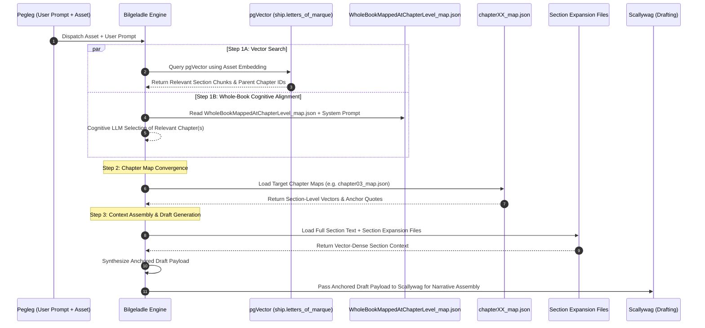

# Bilgeladle Map-Expand-Reduce Asset Alignment Architecture

## Overview
This document defines the definitive **Map-Expand-Reduce Asset Alignment Protocol** executed by **Bilgeladle**. This architecture evaluates external assets (URLs, academic papers, news articles, raw text snippets) against the master book manuscript and generates anchored draft context for **Scallywag** and the rest of the fleet.

---

## 🏗️ 3-Step Dual-Path Alignment Protocol

---

## Detailed Step Breakdown

### Step 1: Parallel Alignment (1A & 1B)
* **Step 1A (Vector DB Hybrid Search)**:
  - Embed the inbound asset and query the PostgreSQL `ship.letters_of_marque` vector database.
  - Return relevant section chunks (each chunk represents a complete section in the VDB index) along with their parent Chapter IDs.
* **Step 1B (Whole-Book Cognitive LLM Alignment)**:
  - Bilgeladle loads `src/react_agent/core_knowledge_vault/WholeBookMappedAtChapterLevel_map.json` along with her core System Instruction (`=== OPERATIONAL RULES & LEARNED DIRECTIVES ===`).
  - Reads the asset text and uses LLM cognitive reasoning to select top-level relevant chapters.

---

### Step 2: Chapter Map Convergence & Deep Map Loading
* **Convergence Logic**:
  - Bilgeladle converges the target chapters identified by **Step 1A** (parent chapter of VDB section chunks) and **Step 1B** (LLM whole-book reading).
* **Deep Map Loading**:
  - Loads the specific section-level chapter maps for all converged target chapters (e.g. `src/react_agent/core_knowledge_vault/chapter_maps/chapter03_map.json`).
  - Pinpoints the exact target sections, opening vignettes (e.g. Paul Yura, Camp Mystic, Bryton Shang), and Anchor Quotes.

---

### Step 3: Section Expansion Context Assembly & Draft Synthesis
* **Context Assembly**:
  Bilgeladle retrieves:
  1. **Full Section Text**: Verbatim text of target sections from `ship.letters_of_marque`.
  2. **Section Expansion Files**: Corresponding section expansion files from `manuscript/chapter_expansions/`.
* **Payload Synthesis**:
  - Combines the section context, section expansion files, the original asset, and the user prompt passed along by Pegleg.
  - Generates a grounded, thesis-anchored draft payload explicitly linking the asset to the book's core vectors of destruction.
* **Handoff to Scallywag**:
  - Passes the anchored draft payload to **Scallywag** to write the final narrative draft / satirical essay.
